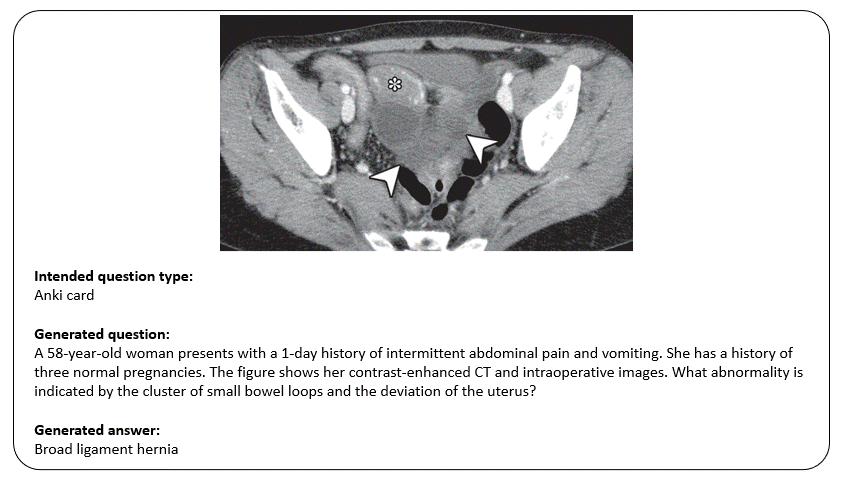

# RadQG
RadQG is an artificial intelligence (AI)-based tool to automatically generate radiology questions based
on the available figures within some user-input articles from the [RadioGraphics](https://pubs.rsna.org/journal/radiographics) journal. 
RadQG works with large language models (LLMs) and this repository contains the functionalities to utilize those models for generating 
questions and developing a question bank.

<p> Developer: Pouria Rouzrokh, MD, MPH, MHPE [rouzrokh.pouria@mayo.edu]

A brief demo of our app is available below:



## How to Run

> This repository is set up to mostly run with a GradIO application. Please run the 
`demo/gradio_demo.py` file to run the GUI. You can change the local port number, if needed. Alternatively, you can
run the `demo/notebook_demo.ipynb` file to run the pipeline in a notebook environment.

- Please start by installing the required packages in the `requirements.txt` file.

- Enter your OpenAI API key in the `configs.py` file. 

- Feel free to change the other parameters in the `configs.py` file according to your needs.

- If running the `demo/notebook_demo.ipynb` file, please make sure to upload your RadioGraphics HTML files in the `data/html_articles` folder.

- Refer to the `demo/notebook_demo.ipynb` file or the `demo/gradio_demo.py` for further instructions.

## Development Logs

```python

### 10/30/2023:

- Changed the name of the prompting models for clarity.
- Changed the name of the OpenAI models for clarity.

### 10/29/2023:

- Added the `generate.py` file to include the functionalities for generating the questions.
- Added the `utils.py` file to include the utility functions.
- Added the `prompts.py` file to include the prompt templates for LLMs.
- Added he `llm/openai.py` file to include the functionalities for loading the LLMs using the OpenAI API.
- Added the `demo/notebook_demo.ipynb` file to include the demo of the pipeline in a notebook environment.

### 10/28/2023:

- Reorganized the repo to reflect the new version of RadQG which will be based on Q/A from RadioGraphics figures.
- Added the `parse_html.py` file to include functionalities for HTML parsing and extracting the text, figures, and figure captions from the HTML files.
- Archived the old version of RadQG in the `archive` folder.
- Removed the `demo` folder.

### 10/27/2023:

- Set up pre-commit in the repo.
- Added `balck` and `black-nb` to the pre-commit hooks.

### 08/10/2023:

- Changed the name of the repository to "RadQG".
- Added the `main.py` file to run the pipeline using GradIO.
- Solved a bug that prevented correct query building and cosine similiarity calculation.
- Added the GIF demo of the pipeline to the `demo` folder.
- Added the `demo.mp4` and `demo.gif` files to the `demos` folder.

### 08/09/2023:

- Added the `configs.py` file.
- Added the `toy data`.
- Added the `chain_prompts.py`
- Added the `general_utils.py`
- Added the `rag.py`
- Added the `demo.ipynb`.
- Tested the pipeline on the toy data and in the demo notebook.
- Tested the functionality of the pipeline with "GPT-4" model.

### 08/08/2023:

- Created the repository.
- Cleaned and added the code for the text preprocessing.
- Added the `requirement.txt` baseline file. 